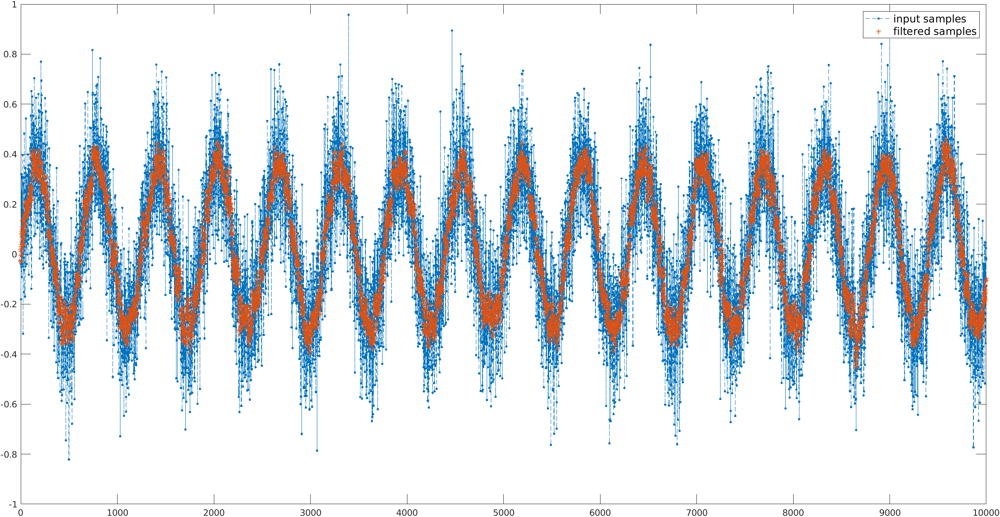
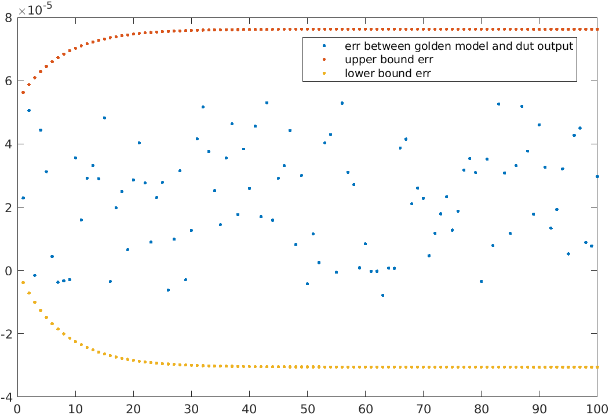

# IIR implementation
This IIR implementation is an example of first-order IIR filer with testbench to check the simulation results. Key features of the provided IIR are:
- Difference equation is $$y[n] = ax[n] + (1-a)y[n-1]$$, where a = 2^(-A). In the example, A is 3 and division operation is realized by arithmetic shift.
- Data type of input and output is `ap_fixed<16,2>`
- Theoretical quantization error falls in the range of (-0.000031,0.000076). Random simulation quantization error falls in the range of (-0.000019, 0.000066). Check [xxx](#Calculate-theoritical-quantization-error) for the theorithical proof.
## Implementation structure
*IIR structure*
## Testbench
### Get reference input and output
Testbench stimuli and reference ouput are obtained from Matlab scripts`./matlab/get_matlab_reference_testdata_rand.m` and `./matlab/get_matlab_reference_testdata_sin.m`. \
The same IIR filter in Matlab is realized by Matlab [1-D filter function](https://www.mathworks.com/help/matlab/ref/filter.html?s_tid=doc_ta).



Testdata is stored in binary file `./testData/testdata.bin` and later read by C testbench
### Run C testbench
Run tcl file to create Vitis_hls project, run C simulation and RTL simulation
```
cd ./vitis_hls
vitis_hls -f run_hls.tcl
```
C testbench reads testdata generated from the previous step,  drives the IIR with stimuli, and compares DUT and Matlab reference output with quantization error boundary. The DUT output will also be stored in `./vitis_hls/proj/solution/csim/build/dut_output.bin` for further plot.
### Check DUT output in Matlab
`./matlab/check_sim_result.m` reads testdata.bin and dut_output.bin, and compare the results with theoretical quantization error bound curve. Given the IIR parameter, the upper bound is $$(\sum_{i=1}^{A-1}-2^{-(fwidth+A+1+i)})*2^{A}*(1-\frac{2^{A}-1}{2^{A}})^{n+1} + \sum_{i=1}^{A}-2^{-(fwidth+i)}$$ and lower bound is $$-2^{-(fwidth+A+1)}*2^{A}*(1-\frac{2^{A}-1}{2^{A}})^{n+1}$$, where `A` is shift distance and `fwidth` is the fraction width of data type.
The figure below shows that simulation error is inside of the boundary.
\
Note that the actual simulation error should be much better than theoretical boundary. This is because the error on the boundary can only be achieved when the maximum quantization error is introduced every time when data is quantized to a smaller precision, which explains, in the figure below, the acutal quantization error occupies only ~70% of the error boundary.

## Calculate theoritical quantization error
Quantization error can be considered as an `unit step input` with varying range. Variable `diff` use the rounding method of `AP_RND`, which is  equvilent to introduce an error after the shift operator in the structure, shown as the `quantization error` in the figure below

*IIR Structure with quantization error*
The data type of `diff` variable is `ap_fixed<17,2>`, and one of the operands of the previous shift operation is `ap_fixed<18,2>`. Therefore when the result is converted to `diff`, HLS rounds the value to the nearest representable value of `ap_fixed<17,2>`, which means the added quantization error ranges from $-20^{-19}-20^{-20}$ to $2^{-18}$ (denoted as $quan_{range}$). Then the difference equation with the added quantization error can be rewriten as $$\begin{align*}y_{err}[n] &= ax[n] + (1-a)y_{err}[n-1]\\ &= a(x[n]-y_{err}[n-1]) + qan_{err} + y_{err}[n-1]\\y_{err}[n] &= y[n] + err[n]\end{align*}$$ and the original difference equation shows that $$y[n] = a(x[n]-y[n-1]) + y[n-1]$$, so $err[n]$ can be expressed as a function of $quan_{err}$ $$err[n] = -a*err[n-1]+err[n-1]+quan_{err}$$ The transfer function of the difference equaltion above is $$\frac{E}{Q_{err}} = \frac{1}{1-Z^{-1}(1-a))}$$, where $a=2^{-A}$ which is $1/8$ in this case. As mentioned in the beginning of this section, $Q_{err}$ is equvialent to `unit step` function with varying amplitude of $quan_{range}$, therefore $E$ in the above equation can be rewriten as the follow. $$E = \frac{1}{1-\frac{7}{8}Z^{-1}}\frac{quan_{range}}{1-Z^{-1}}$$ In the time domain, err[n] can be rewritten: $$err[n] = 8quan_{err}(1-(\frac{7}{8})^{n+1})$$. By applying lower and upper bound of $quan_{range}$, the error boundary of variable `y_reg_` can be derived.
