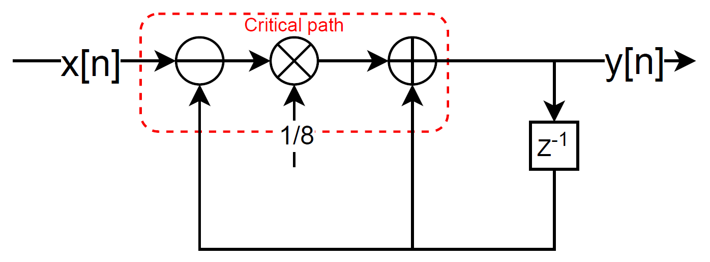
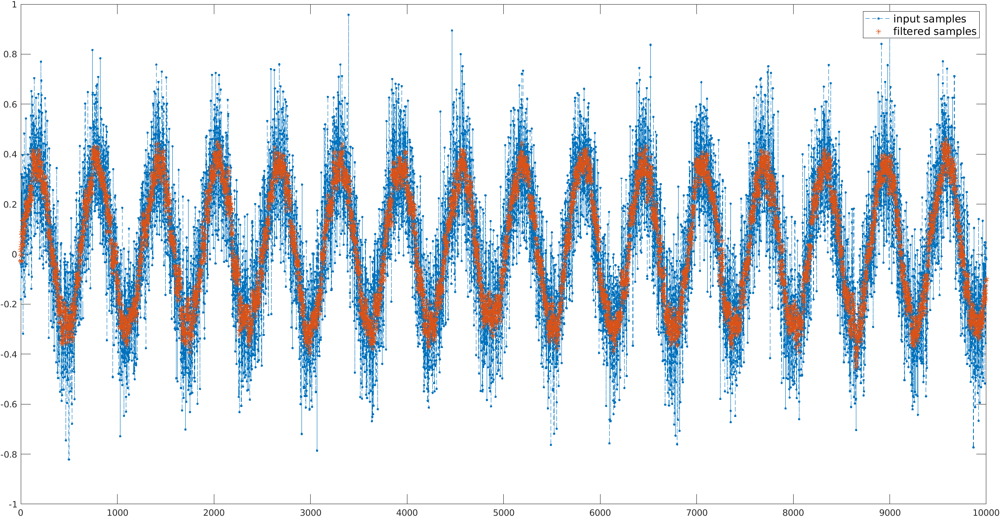
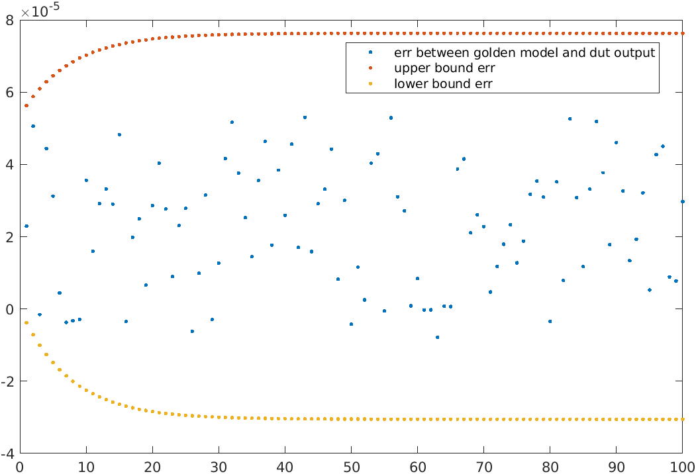
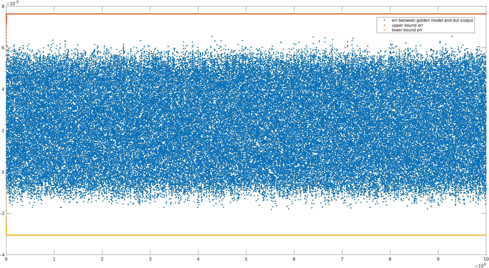
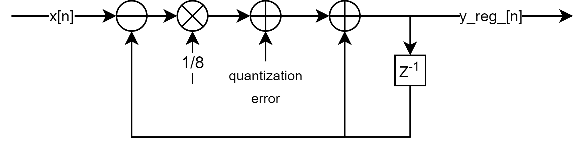
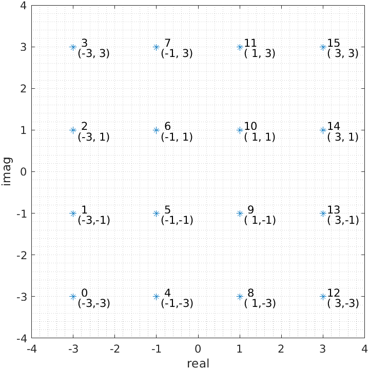
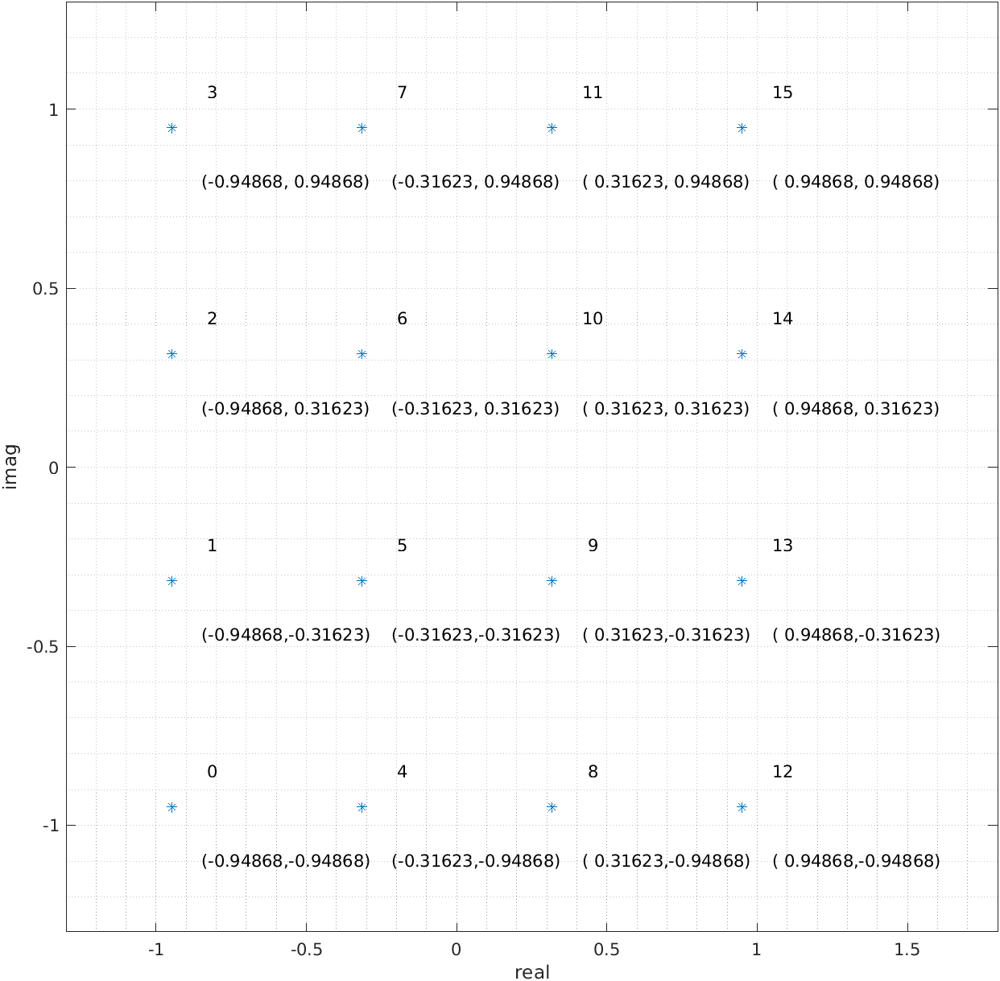
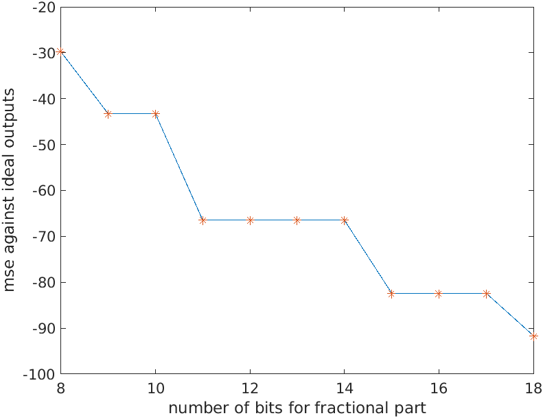

# DAFIP
Digital ASIC FPGA IP examples
- [DAFIP](#dafip)
- [Overview](#overview)
- [IIR implementation](#iir-implementation)
  * [Implementation structure](#implementation-structure)
  * [Testbench](#testbench)
  * [Calculate theoritical quantization error](#calculate-theoritical-quantization-error)
- [Gray and binary number convertion](#gray-and-binary-number-convertion)
  * [Background](#background)
  * [Binary to gray](#binary-to-gray)
  * [Gray to binary](#gray-to-binary)
- [QAM modulation](#qam-modulation)
  * [non-normalized QAM](#nonnormalized-qam)
  * [normalized QAM](#normalized-qam)
  * [Demodulation](#demodulation)
  * [Data precision v.s. MSE](#data-precision-vs-mse)
# Overview
| IP                  | Implementation | Verification | Documentation | Category |
|---------------------|----------------|--------------|---------------|----------|
| [IIR](https://github.com/HaogeL/DAFIP/tree/main/IIR)|:white_check_mark:|:white_check_mark:|:white_check_mark:| DSP      |
| [AsyncFIFO](https://github.com/HaogeL/DAFIP/tree/main/AsyncFIFO)|:white_check_mark:|:x:|:x:| CDC      |
| [SyncFIFO](https://github.com/HaogeL/DAFIP/tree/main/SyncFIFO)|:white_check_mark:|:x:|:x:| Common   |
| [RoundRobinArbiter](https://github.com/HaogeL/DAFIP/tree/main/RoundRobinArbiter)|:white_check_mark:|:x:|:x:| Common   |
| [FrequencyDivider](https://github.com/HaogeL/DAFIP/tree/main/FrequencyDivider/3)|:white_check_mark:|:x:|:x:| Common   |
| [Multi-based divider](https://github.com/HaogeL/multiplication_based_divider/blob/master/readme/readme.pdf)|:white_check_mark:|:x:|:white_check_mark:| DSP      |
| [FSMTemplate](https://github.com/HaogeL/DAFIP/tree/main/FSMTemplate)|:white_check_mark:|:x:|:x: | Common   |
| [GrayBinConversion](https://github.com/HaogeL/DAFIP/tree/main/GrayBin)|:white_check_mark:|:white_check_mark:|:white_check_mark:| Common   |
| [FIR](https://github.com/HaogeL/DAFIP/tree/main/FIR)|:white_check_mark:|:white_check_mark:|:white_check_mark:| DSP   |
| [QAMMOF](https://github.com/HaogeL/DAFIP/tree/main/QamMod)|:white_check_mark:|:white_check_mark:|:white_check_mark:| DSP   |
# IIR implementation
This IIR implementation is an example of first-order IIR filer with testbench to check the simulation results. Key features of the provided IIR are:
- Difference equation is $$y[n] = ax[n] + (1-a)y[n-1]$$, where a = 2^(-A). In the example, A is 3 and division operation is realized by arithmetic shift.
- Data type of input and output is `ap_fixed<16,2>`
- Theoretical quantization error falls in the range of (-0.000031,0.000076). Random simulation quantization error falls in the range of (-0.000019, 0.000066). Check Section [Calculate theoritical quantization error](#Calculate-theoritical-quantization-error) for the theorithical proof.
## Implementation structure
*IIR structure*
## Testbench
### Get reference input and output
Testbench stimuli and reference ouput are obtained from Matlab scripts`./matlab/get_matlab_reference_testdata_rand.m` and `./matlab/get_matlab_reference_testdata_sin.m`. \
The same IIR filter in Matlab is realized by Matlab [1-D filter function](https://www.mathworks.com/help/matlab/ref/filter.html?s_tid=doc_ta).



Testdata is stored in binary file `./testData/testdata.bin` and later read by C testbench
### Run C testbench
Run tcl file to create Vitis_hls project, run C simulation and RTL simulation
```
cd ./vitis_hls
vitis_hls -f run_hls.tcl
```
C testbench reads testdata generated from the previous step,  drives the IIR with stimuli, and compares DUT and Matlab reference output with quantization error boundary. The DUT output will also be stored in `./vitis_hls/proj/solution/csim/build/dut_output.bin` for further plot.
### Check DUT output in Matlab
`./matlab/check_sim_result.m` reads testdata.bin and dut_output.bin, and compare the results with theoretical quantization error bound curve. Given the IIR parameter, the upper bound is

$$
\sum_{i=1}^{A-1}-2^{-(fwidth+A+1+i)} * 2^{A}*(1-\frac{2^{A}-1}{2^{A}})^{n+1} + \sum_{i=1}^{A}-2^{-(fwidth+i)}
$$

and lower bound is

$$
-2^{-(fwidth+A+1)} * 2^{A}*(1-\frac{2^{A}-1}{2^{A}})^{n+1}
$$

,where `A` is shift distance and `fwidth` is the fraction width of data type.
The figure below shows that simulation error is inside of the boundary.
\
Note that the actual simulation error should be much better than theoretical boundary. This is because the error on the boundary can only be achieved when the maximum quantization error is introduced every time when data is quantized to a smaller precision, which explains, in the figure below, the acutal quantization error occupies only ~70% of the error boundary.

## Calculate theoritical quantization error
Quantization error can be considered as an `unit step input` with varying range. Variable `diff` use the rounding method of `AP_RND`, which is  equvilent to introduce an error after the shift operator in the structure, shown as the `quantization error` in the figure below

*IIR Structure with quantization error*

The data type of `diff` variable is `ap_fixed<17,2>`, and one of the operands of the previous shift operation is `ap_fixed<18,2>`. Therefore when the result is converted to `diff`, HLS rounds the value to the nearest representable value of `ap_fixed<17,2>`, which means the added quantization error ranges from $-20^{-19}-20^{-20}$ to $2^{-18}$ (denoted as $quan_{range}$). Then the difference equation with the added quantization error can be rewriten as

$$
\begin{align}
y_{err}[n] &= ax[n] + (1-a)y_{err}[n-1] \\ 
&= a(x[n]-y_{err}[n-1]) + qan_{err} + y_{err}[n-1] \\
y_{err}[n] &= y[n] + err[n]
\end{align}
$$

and the original difference equation shows that $$y[n] = a(x[n]-y[n-1]) + y[n-1]$$, so $err[n]$ can be expressed as a function of $quan_{err}$ $$err[n] = -a*err[n-1]+err[n-1]+quan_{err}$$ The transfer function of the difference equaltion above is $$\frac{E}{Q_{err}} = \frac{1}{1-Z^{-1}(1-a))}$$, where $a=2^{-A}$ which is $1/8$ in this case. As mentioned in the beginning of this section, $Q_{err}$ is equvialent to `unit step` function with varying amplitude of $quan_{range}$, therefore $E$ in the above equation can be rewriten as the follow. $$E = \frac{1}{1-\frac{7}{8}Z^{-1}}\frac{quan_{range}}{1-Z^{-1}}$$ In the time domain, err[n] can be rewritten: $$err[n] = 8quan_{err}(1-(\frac{7}{8})^{n+1})$$. By applying lower and upper bound of $quan_{range}$, the error boundary of variable `y_reg_` can be derived.

# Gray and binary number convertion
This repo provides IP example of gray-code to binary-code and binary-code to gray-code conversion. Binary-to-gray conversion is simple. Implementation of gray-to-binary is straightforward as well. However, for strict timing constraints, optimizing gray-to-binary conversion can be a little bit complicated.
## Background
Visit https://en.wikipedia.org/wiki/Gray_code
## Binary to gray
Binary-to-gray is simple and easy, and there is nothing to optimize. All **xor** operations of each bit-pair can be performed in parallel. HLS code is as simple as below
```C
template <class DATA_T> 
DATA_T bin2gray(DATA_T bin) {
  DATA_T gray = bin ^ (bin >> 1);
  return gray;
}
```

Steps to run the implementation of binary-to-gray conversion are
```
cd <repo-path>/GrayBin/vitis_hls
vitis_hls -f run_hls_bin2gray
vitis_hls -p bin2gray
```
## Gray to binary
Gray-code to binary-code conversion is not difficult: in a word, given N-bit input (**gray**), each bit of binary output, **bin[n]**, can be recursively xor-ed from **bin[n+1]** and **gray[n]**, and **bin[MSB]** is same as **gray[MSB]**. Therefore, the simplest implementation of gray-to-binary conversion is nothing but an **xor chain**, which is very similar to ripple carry adders, i.e. the previous output of **xor** is the current input of **xor**. The cirtical path is always the longest path of the chain, which yields **bin[LSB]**. Run the following steps to see the implementation of this kind of non-optimized gray-to-binary conversion.
```
cd <repo-path>/GrayBin/vitis_hls
vitis_hls -f run_hls_gray2bin
vitis_hls -p gray2bin
```
### Optimize timing: trade area for timing
Because xor operation is **commutative** and **associative**, we can xor many different bits in parallel. Implementation found in function [gray2bin_paral](https://github.com/HaogeL/DAFIP/blob/main/GrayBin/vitis_hls/gray_bin.h#L63) utilizes the idea of [parallel prefix algorithms](https://www.chessprogramming.org/Parallel_Prefix_Algorithms). The delay for N-bit gray-to-bincary convertion roughly equals to $ceil(log_{2}{N})$ times of the propagation dealy of an **xor** operation. In the provided example, C synthesis results of optimized and non-optimized gray-to-binary conversions are compared in the table below with ap_vld as port-level protocal and ap_ctrl_hs as block-level protocal.
```text
+----------------+-------+---------+--------+---------+----------+----+----+
|     Modules    |       | Latency | Latency|         |          |    |    |
|     & Loops    | Slack | (cycles)|  (ns)  | Interval| Pipelined| FF | LUT|
+----------------+-------+---------+--------+---------+----------+----+----+
|+ gray2bin_hls  |  -0.95|        1|   1.952|        1|       yes|  34|  64|
+----------------+-------+---------+--------+---------+----------+----+----+

+----------------------+------+---------+--------+---------+----------+---+-----+
|        Modules       |      | Latency | Latency|         |          |   |     |
|        & Loops       | Slack| (cycles)|  (ns)  | Interval| Pipelined| FF|  LUT|
+----------------------+------+---------+--------+---------+----------+---+-----+
|+ gray2bin_paral_hls  |  0.16|        1|   1.000|        1|       yes| 58|  162|
+----------------------+------+---------+--------+---------+----------+---+-----+
```
# QAM modulation
HLS desgin [QamMod directory](https://github.com/HaogeL/DAFIP/tree/main/QamMod/vitis_hls) demonstrates 4, 16, 64, 256 QAM modulation examples with binary symbol order. Their implementations are all derived from [QamMod.h](https://github.com/HaogeL/DAFIP/blob/main/QamMod/vitis_hls/QamMod.h), thus it is easy to expand to higher modulation formats, such as 1K QAM. 

## non-normalized QAM
For non-normalized QAM modulation, symbol space is 2, and symbol order of 16-QAM as an example is shown as figure below. By using [bin2gray converter](https://github.com/HaogeL/DAFIP/blob/main/GrayBin/vitis_hls/gray_bin.cpp), gray-code ordering is easily achieved. 

*QAM16 example*

## normalized QAM
Based on non-normalized QAM modulation, fixed-point numbers are used to represent constellation, and the average power is normalized to 1. As a comparison of the figure above, normalized 16-QAM constellation is plotted below.
*Normalized QAM16 example*

FPGA resource comsumption for 4-, 16-, 64-, 256- QAM are listed below, with constellation is represented by **std::complex<ap_fixed<20, 2>>**, in which port-level and block-level are removed and therefore they are considered as combinational logic. For device xcvu9p-flga2104-2-i, their speed, with constraint of 1 ns, are shown in the table as well.
| 4- QAM                                                                      | 16- QAM                                                                     | 64- QAM                                                                    | 256- QAM                                                                    |
|-----------------------------------------------------------------------------|-----------------------------------------------------------------------------|----------------------------------------------------------------------------|-----------------------------------------------------------------------------|
| LUT:    2; Others: 0                                                         | LUT:    4; Others: 0                                                         | LUT:    12; Others: 0                                                       | LUT:    34; Others: 0                                                        |
| Max path delay: 0.038ns  (logic 0.038ns (100.000%)  route 0.000ns (0.000%)) | Max path delay: 0.038ns  (logic 0.038ns (100.000%)  route 0.000ns (0.000%)) | Max path delay: 0.249ns  (logic 0.229ns (91.968%)  route 0.020ns (8.032%)) | MAX path delay: 0.593ns  (logic 0.328ns (55.312%)  route 0.265ns (44.688%)) |

## Demodulation
Demodulation algorithm is reverse process of QAM modulation, which is implemented in [QamMod.h](https://github.com/HaogeL/DAFIP/blob/main/QamMod/vitis_hls/QamMod.h).

## Data precision v.s. MSE
All the examples of normalized QAM modulations use **std::complex<ap_fixed<20, 2>>** to represent constellations, which is not identical to ideal double datetype. Define the MSE as 
$$MSE = \frac{1}{M\cdot pow_{avg}}\sum_{i=1}^{M}(|cst_{ideal}-cst_{hls}|^{2})$$
, where M is the size of constellation, $cst_{ideal}$ and $cst_{hls}$ are ideal and fixed-point constellation outputs, respectively, $M$ is modulation size, and $pow_{avg}$ is the average power of constellation.

As an example, steps to check MSE of 256 QAM follows below. 
```bash
cd QamMod/vitis_hls
vitis_hls -f run_hls_Qam256_normalized.tcl
cd ../matlab && matlab
>> CheckQamResult(256, 1)
For normolized256QAM
average power of HLS QAM output is 0.999947576929117
average power of ideal QAM output is 1.000000000000000
quantization mse -91.630037 db
```
The following figure shows decreasing MSE when more fractional bits are used to represent constellations.
 

# FIR

## Normal FIR with real input signal
```bash
# generate test data and coefficients from Matlab
cd FIR/matlab
matlab -nodesktop -nojvm -r "run('getTestData.m'); exit"
# run vitis model, vitis project is located in the directory named proj
cd ../vitis_hls
vitis_hls -f run_hls.tcl
# run matlab script to check the quality of results
cd ../matlab
matlab -nodesktop -r "run('checkDutResult.m');"
# type exit to quit Matlab CLI
```

## Complex FIR with complex input signal and coefficients
```bash
# generate test data and coefficients from Matlab
cd FIR/matlab
matlab -nodesktop -nojvm -r "run('getTestData_cplx.m'); exit"
# run vitis model, vitis project is located in the directory named proj_cplx
cd ../vitis_hls
vitis_hls -f run_hls_fir_cplx.tcl
# run matlab script to check the quality of results
cd ../matlab
matlab -nodesktop -r "run('checkDutResult_cplx.m');"
# type exit to quit Matlab CLI
```